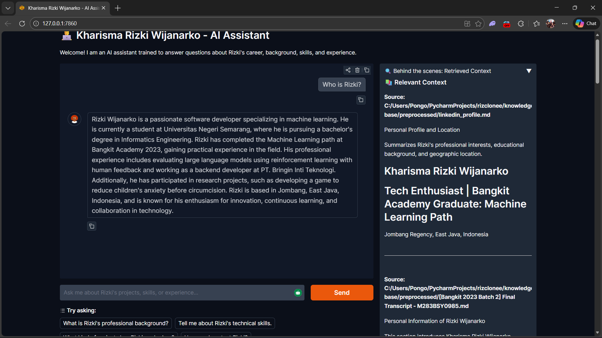

# RizClone - Kharisma Rizki Wijanarko AI Assistant
<p align="center">
  
</p>

RizClone is an advanced RAG (Retrieval-Augmented Generation) based AI assistant designed to represent **Kharisma Rizki Wijanarko (Rizki)**. It answers questions about his career, background, skills, and experience by retrieving relevant information from a curated knowledge base of his LinkedIn profile, CV, and other documents.

## Features

- **RAG-based Question Answering**: Uses a vector database to provide accurate, context-aware answers based on Rizki's professional background.
- **Advanced Retrieval Pipeline**:
    - **Query Rewriting**: Automatically refines user questions to improve search relevance.
    - **Hybrid Retrieval**: Combines original and rewritten query results for better coverage.
    - **LLM-based Reranking**: Intelligently ranks retrieved context chunks to ensure the most relevant information is used.
- **Tool Integration**:
    - **Unknown Question Tracking**: Automatically records questions the AI cannot answer and notifies Rizki via Telegram.
    - **Lead Capture**: Records user contact details and interests for future follow-up.
- **Interactive Web UI**: Built with Gradio, featuring a professional orange/slate theme and real-time "behind-the-scenes" retrieval visualization.
- **Automated Document Ingestion**: Preprocesses PDF documents (CVs, Transcripts, etc.) into clean Markdown and ingests them into a ChromaDB vector store.
- **Evaluation Suite**: Tools for calculating retrieval metrics like MRR (Mean Reciprocal Rank) and nDCG (Normalized Discounted Cumulative Gain), and evaluating answer quality.

## Technical Stack

- **LLM Engine**: [LiteLLM](https://github.com/BerriAI/litellm) (supporting `openai/gpt-4.1-nano`)
- **Embeddings**: OpenAI `text-embedding-3-large`
- **Vector Database**: [ChromaDB](https://www.trychroma.com/)
- **Preprocessing**: [Unstructured](https://unstructured.io/) (for PDF to Markdown conversion)
- **UI Framework**: [Gradio](https://gradio.app/)
- **Language**: Python 3.12+
- **Dependency Management**: `uv` (recommended) or `pip`

## Project Structure

```text
rizclone/
├── app.py                # Main Gradio application
├── implementation/       
│   ├── chat.py           # Core RAG logic, query rewriting, and reranking
│   ├── ingest.py         # Document chunking and vectorstore creation
│   └── preprocess.py     # PDF to Markdown preprocessing logic
├── evaluation/           
│   ├── eval.py           # Evaluation pipeline (MRR, nDCG, Answer quality)
│   └── test.jsonl        # Test dataset for evaluation
├── knowledge-base/       
│   ├── raw/              # Original PDF documents
│   └── preprocessed/     # Extracted Markdown files
├── preprocessed_db/      # ChromaDB persistent storage
├── pyproject.toml        # Project dependencies
└── .env.example          # Template for environment variables
```

## Setup & Installation

### 1. Prerequisites
- Python 3.12 or higher.
- `uv` installed (recommended: `pip install uv`).

### 2. Clone the Repository
```bash
git clone <repository-url>
cd rizclone
```

### 3. Install Dependencies
```bash
uv sync
```

### 4. Configure Environment Variables
Create a `.env` file from the example:
```bash
cp .env.example .env
```
Fill in your API keys:
- `OPENAI_API_KEY`: For embeddings and LLM.
- `GEMINI_API_KEY`: (If using Gemini models via LiteLLM).
- `HF_TOKEN`: (If using HuggingFace models).
- `TELEGRAM_BOT_TOKEN` & `TELEGRAM_CHAT_ID`: For notifications when unknown questions are asked.

## Usage

### Step 1: Preprocess Documents
Place your PDF files in `knowledge-base/raw/` and run:
```bash
python implementation/preprocess.py
```
This converts PDFs to cleaned Markdown in `knowledge-base/preprocessed/`.

### Step 2: Ingest into Vector Database
Generate embeddings and create the ChromaDB index:
```bash
python implementation/ingest.py
```

### Step 3: Run the Application
Launch the interactive AI Assistant:
```bash
python app.py
```
The app will be available at `http://localhost:7860`.

### Step 4: Evaluation (Optional)
To evaluate the retrieval and answer performance:
```bash
python evaluation/eval.py
```

## 🤝 Contributing
Feel free to open issues or submit pull requests for any improvements!
