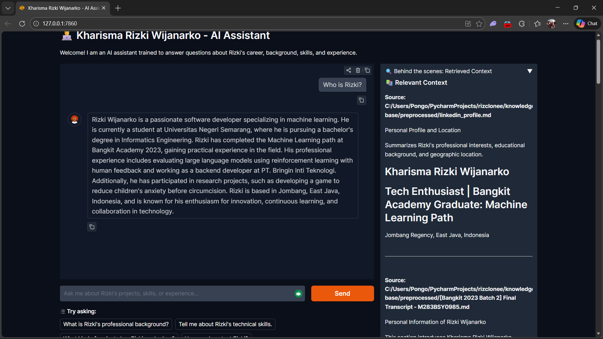
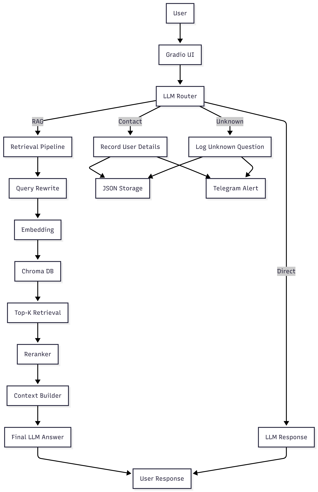

# RizClone - Agentic AI Assistant for Kharisma Rizki Wijanarko

[](https://huggingface.co/spaces/Raiquia/Rizclone)
[](https://huggingface.co/spaces/Raiquia/Rizclone)

> 💡 This project demonstrates an **agentic LLM system** with dynamic routing, tool orchestration, and advanced retrieval techniques.
> ⚠️ Note: The demo may take ~10–30 seconds to load initially due to cold start (free hosting).

<p align="center">
  
</p>

---

## 🎯 Overview

RizClone is an **agentic RAG-based AI assistant** designed to represent **Kharisma Rizki Wijanarko (Rizki)**.

Unlike traditional chatbots, this system uses **LLM-based intent routing** to dynamically decide between:

* retrieval-augmented generation (RAG)
* tool invocation
* direct responses

It answers questions about Rizki’s career, background, skills, and experience using a curated knowledge base (CV, LinkedIn, and supporting documents), while also supporting real-world workflows such as lead capture and notification.

---

## 🧠 System Architecture

<p align="center">
  
</p>

---

## ⚙️ Key System Capabilities

* 🔀 **LLM-based Routing (Agentic Behavior)**
  Dynamically classifies user intent and routes queries to RAG, tools, or direct responses.

* 📚 **Advanced RAG Pipeline**

  * Query rewriting
  * Dual-query hybrid retrieval
  * LLM-based reranking

* 🧰 **Tool-Oriented Architecture**

  * Unknown question logging
  * Automated lead capture (contact + intent)
  * Telegram notifications

* 🧠 **Persistent Memory**
  Stores interactions and logs in structured JSON.

* 🌐 **Interactive Interface**
  Built with Gradio with real-time retrieval visualization.


---

## 🧩 Technical Stack

* **LLM Engine**: LiteLLM (`openai/gpt-4.1-nano`)
* **Embeddings**: OpenAI `text-embedding-3-large`
* **Vector Database**: ChromaDB
* **Preprocessing**: Unstructured
* **UI Framework**: Gradio
* **Language**: Python 3.12+
* **Dependency Management**: uv / pip

---

## 📁 Project Structure

```
rizclone/
├── app.py
├── implementation/
│   ├── chat.py
│   ├── ingest.py
│   └── preprocess.py
├── knowledge-base/
│   ├── raw/
│   └── preprocessed/
├── preprocessed_db/
├── pyproject.toml
└── .env.example
```

---

## ⚙️ Setup & Installation

### 1. Prerequisites

* Python 3.12+
* uv (recommended)

Install uv:

```
pip install uv
```

---

### 2. Clone Repository

```
git clone https://github.com/rizkiwijanarko/rizclone.git
cd rizclone
```

---

### 3. Install Dependencies

```
uv sync
```

---

### 4. Configure Environment

```
cp .env.example .env
```

Fill in:

* OPENAI_API_KEY
* GEMINI_API_KEY (optional)
* HF_TOKEN (optional)
* TELEGRAM_BOT_TOKEN
* TELEGRAM_CHAT_ID

---

## 🚀 Usage

### 1. Preprocess Documents

```
uv run implementation/preprocess.py
```

---

### 2. Ingest into Vector Database

```
uv run implementation/ingest.py
```

---

### 3. Run Application

```
uv run app.py
```

Access:

```
http://localhost:7860
```

---

## 🎯 Motivation

This project explores how modern LLM systems go beyond static Q&A by incorporating:

* decision-making (agentic routing)
* tool usage
* persistent memory
* retrieval optimization

It simulates a real-world AI assistant capable of interacting with recruiters or clients.

---

## 🤝 Contributing

Contributions, issues, and suggestions are welcome!
